# Background
You can find more technical detail in the [repo itself](https://github.com/jerryryle/bleatbox).

A few weeks ago, one of my coworkers posted in Slack:

> @Jerry Ryle
> Problem statement: Tissues boxes are not readily available in all parts of the office, causing decrease in productivity due to excessive context switching when needing a tissue
> 
> * Needing a tissue is often unforeseen and needs to be resolved urgently.
> * Placement of tissues in shared areas is inconsistent and sparse.
> * Getting a tissue from someone else's desk feels awkward
> * Keeping tissues on every desk is not scalable.
> 
> Proposed solution: 3D printed tissue box holders on the pillars around the office.
> Other solutions considered: I'd love to be committed to this bit, but I have other things to do

That turned into a whole thread on Other Solutions, which included [just-in-time tissue printing](https://www.yuancuimachine.com/products/6-lines-facial-tissue-paper-making-machine-automatic-tissue-production-line-with-tissue-cutting-machine/), handkerchiefs, long sleeves, the office dog, [NoseFridas](https://frida.com/products/nosefrida), etc.

Now, the instant I read the first post, I knew exactly what I was going to make: a tissue box that screamed like a goat when you pulled a tissue out of it. What took me a bit longer to understand was that there would be several of them and they would all be networked such that when you pulled a tissue from one and it started screaming, the others would also begin screaming after a short, random delay.

I built the BleatBox on nights and weekends over the course of a few weeks, then installed them in my office on a Monday evening for everyone to enjoy Tuesday morning. Click the image below to see a video of me testing them right after installation.

[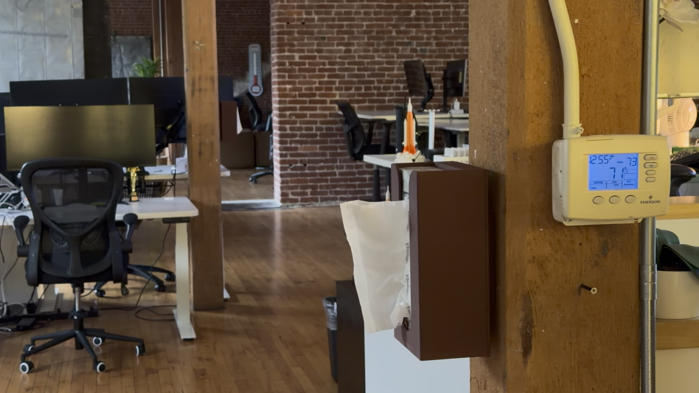](https://youtu.be/knlqAhvIKtw)

# The Making Of
First, I had to decide how I was going to detect a tissue pull. I couldn't use a break-beam across the opening since tissue box openings always have tissues sticking out of them. I bought some [spring-based vibration sensors](https://www.amazon.com/dp/B07S9KR84S), but my tests showed that they were nowhere near sensitive enough to pick up the slight jostling of a box when a tissue is pulled. After more research, I settled on a [LIS2DW12](https://www.mouser.com/ProductDetail/426-SEN0405) accelerometer. It's highly sensitive, very low power, and has a motion interrupt with a configurable threshold.

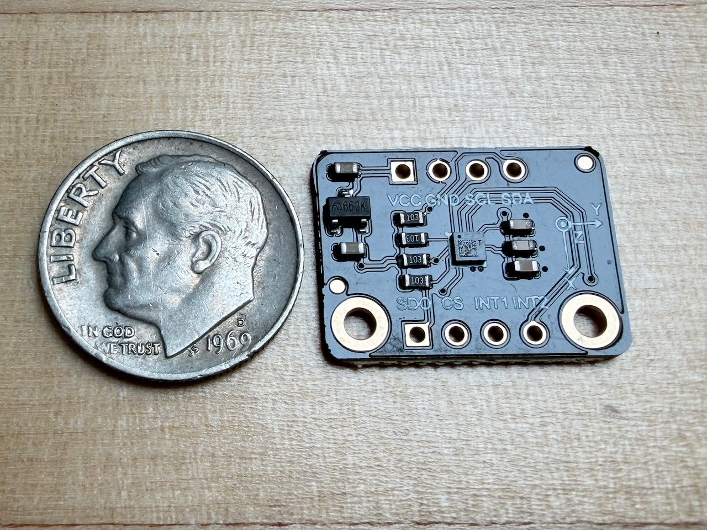

Having figured out my sensor approach, I modeled an enclosure. The front holds a slim box of tissues. I wanted the whole thing to be no larger than a standard tissue box, so I sourced [slim tissue boxes](https://www.amazon.com/dp/B0040ZOD68) to leave room for the electronics.

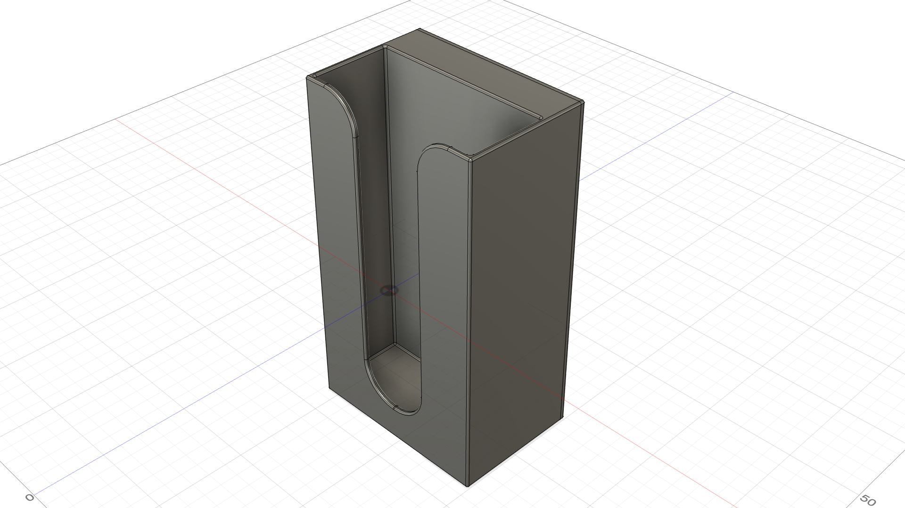

The back holds the electronics and slides onto the front. I added some springy clip thingers on the back and detents on the front to keep the parts in place when assembled.

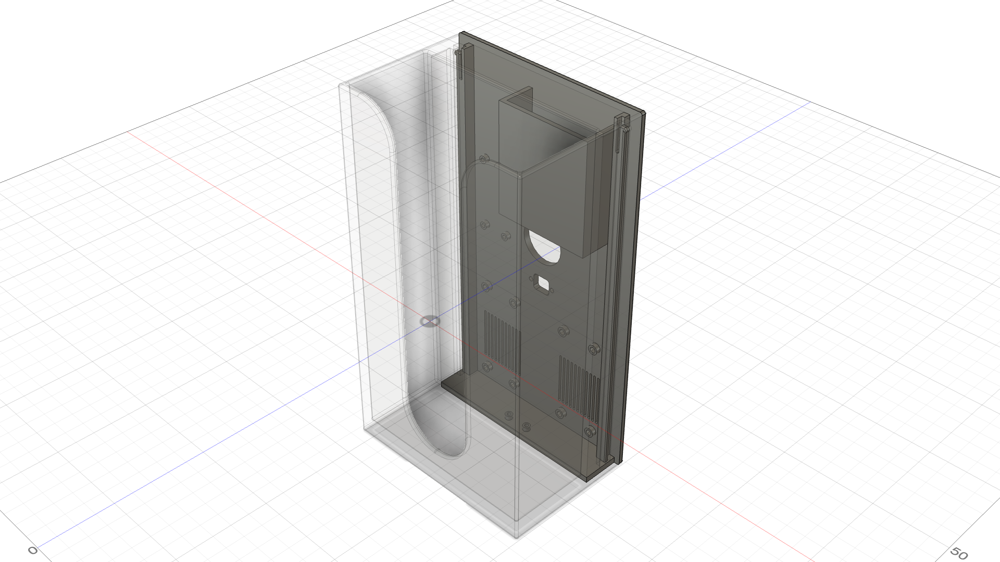

The back has cutouts for a switch and USB port as well as a protruding feature to mate with a wall mount.

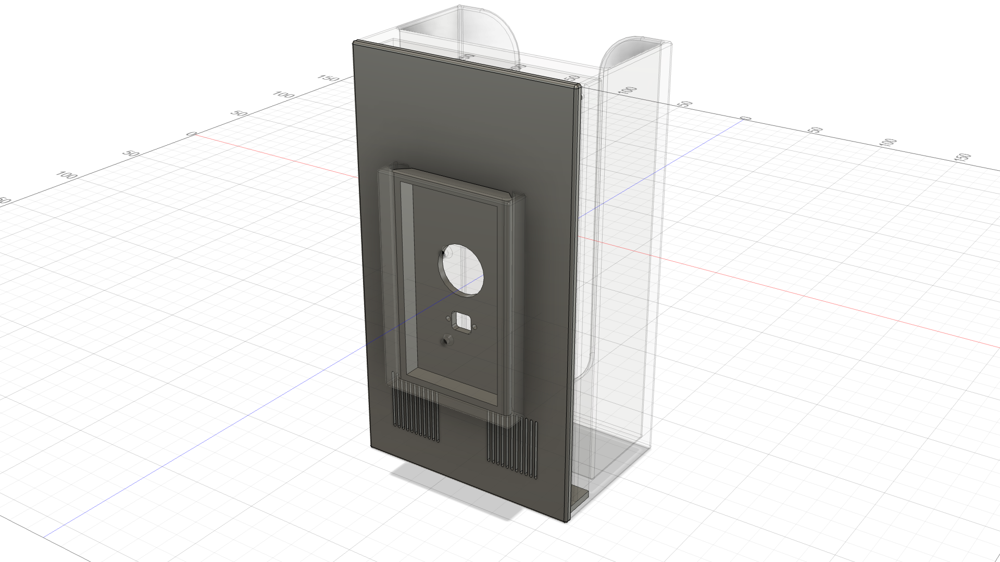

The back slides into the wall mount and gravity keeps it in place.

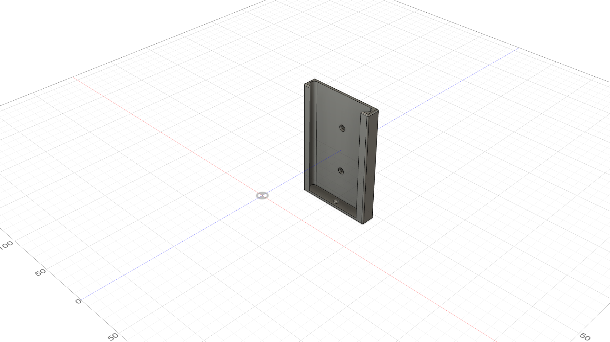

I realized that if I rigidly mount the box to the wall, there's a chance that it wouldn't vibrate enough to trigger the accelerometer when a tissue is pulled. To combat this, I added a 1.5mm offset to the mount to make it a bit loose when mating with the back.

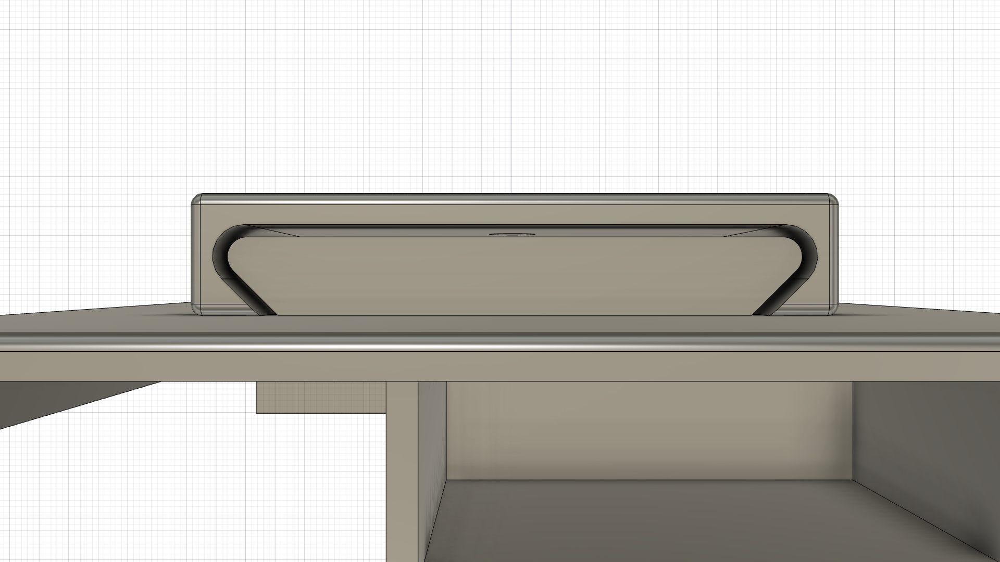

I also added a round nub to the bottom of the wall mount so that the back makes only point contact with the bottom of the mount. This makes it extra janky so the whole thing rattles around when you pull a tissue.

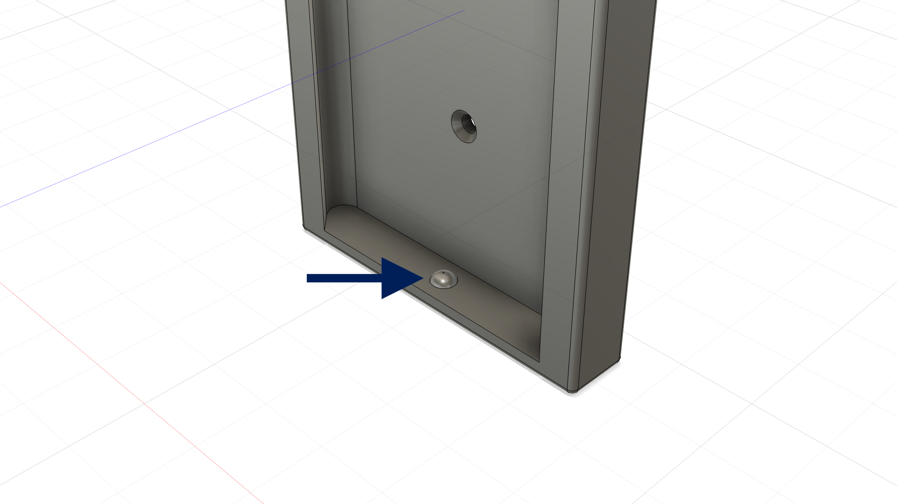

With the enclosure modeled, I could turn to the parts that actually make noise. The electronics comprise:

- an [Adafruit Feather nRF52840 Express](https://www.adafruit.com/product/4062)
- an [Adafruit Music Maker FeatherWing w/ Amp](https://www.adafruit.com/product/3436)
- a [DFRobot LIS2DW12 accelerometer board](https://www.mouser.com/ProductDetail/426-SEN0405)
- an [Adafruit 3.7V 10050mAh Lithium Ion Battery](https://www.adafruit.com/product/5035)
- two [CQRobot 3 Watt 4 Ohm speakers](https://www.amazon.com/dp/B0822Z4LPH)
- a [SparkFun Electronics Panel Mount USB Micro-B Extension Cable](https://www.amazon.com/dp/B087Z6ZWHL)
- a [Nilight Round Rocker Switch](https://www.amazon.com/dp/B0CKXRHJPF)

These were all mounted to the various features I created for them in the back of the enclosure. My cable management probably could have been a little bit better, but I kept it tidy enough with some [Mini Cable Clips](https://www.amazon.com/dp/B08DN2NWKJ).

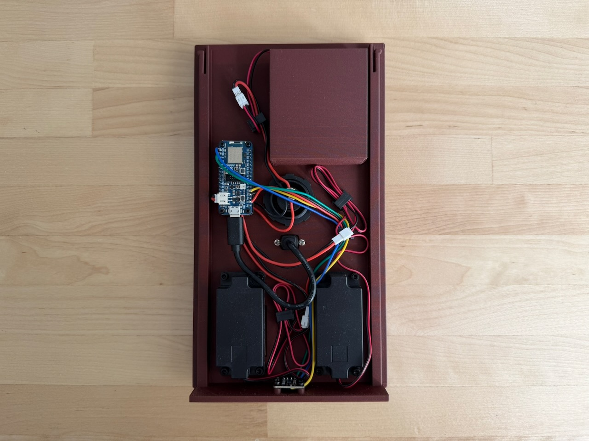

I ran out of modeling steam and never finished a battery retention clip I had intended to make. I settled on the "scrappy" solution of a screw to keep the battery in place.

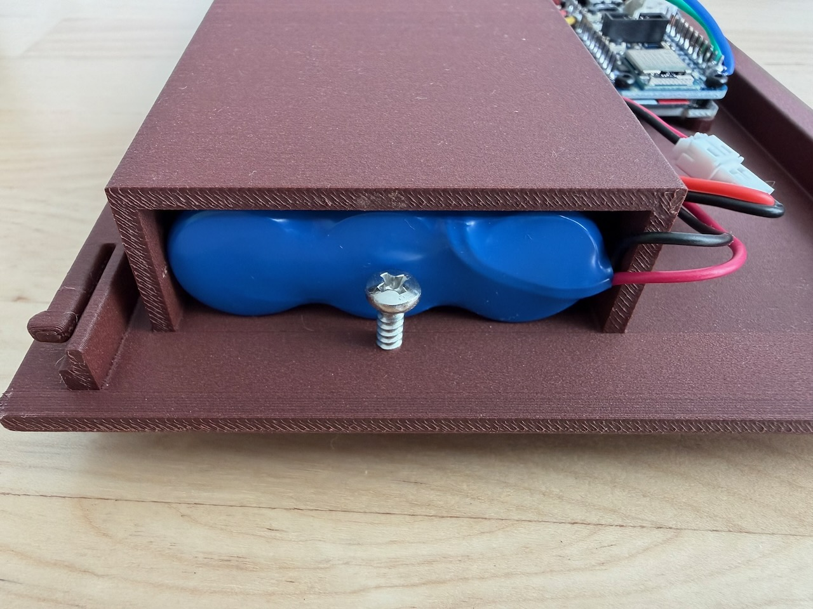

Fully assembled, it looks innocent enough. I originally wanted it to be less obvious that it had space to house electronics, but I would have had to design a custom PCBA instead of using off-the-shelf development boards. That would have been more time and $$$ than I wanted to spend. I also thought of covering the top of the tissue box so it looked like a full-sized Kleenex box, but decided not to spend the time modeling something that snapped or screwed in place. Besides, the open top makes it easy to swap in a new box.

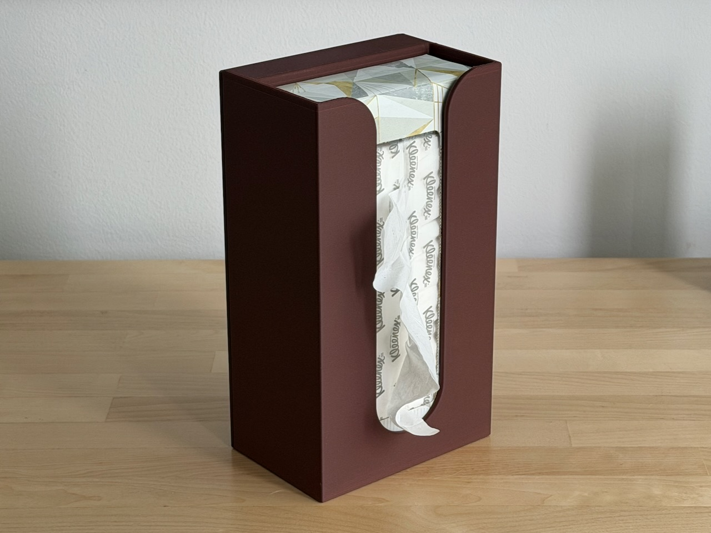

The back has a power switch and a USB port so I can reprogram the feather without opening the enclosure. I did wind up adding Bluetooth LE (BLE) over-the-air firmware update capability, but I wasn't sure if I'd get to that when I designed the enclosure.

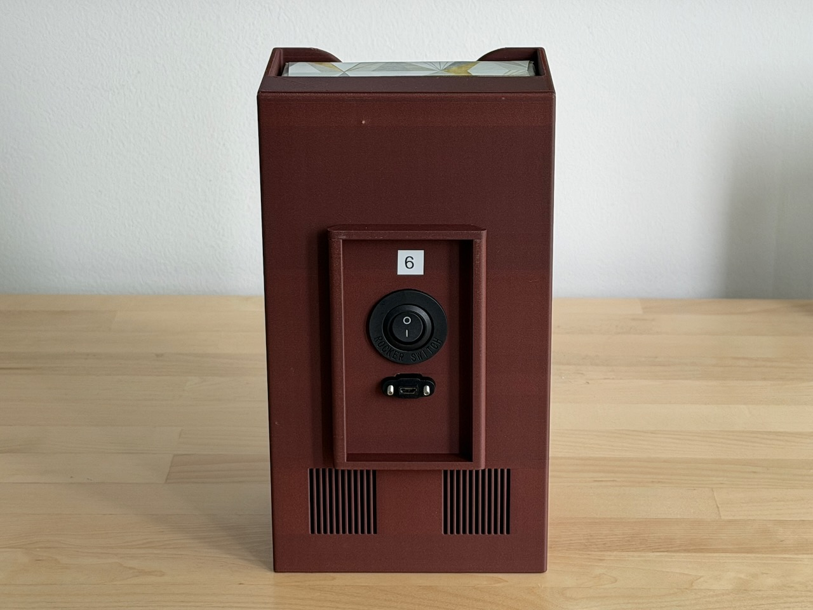

The switch and USB port hide behind the wall mount.

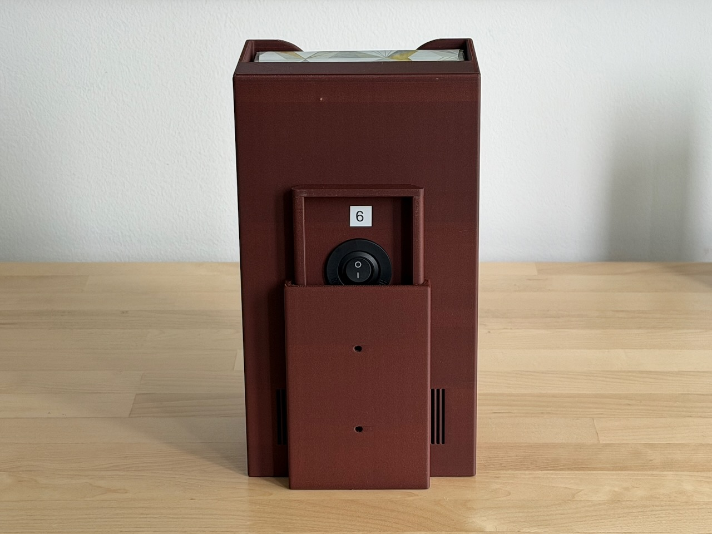

My teammates know, by now, that I'm a prankster, so they'll be expecting *something* when six of these new tissue boxes appear in the office. So as not to disappoint, I ensured that the effect is ridiculously over the top. When you pull a tissue from the box, it plays the sound of a goat screaming. It's always the same sound. But it also chooses random sound assignments and delays for the five other boxes and broadcasts them over BLE. This fills the office with a hysterical cacophony for a few seconds.

That chaos is powered by firmware that's written in C on top of the [Zephyr](https://www.zephyrproject.org) real-time operating system. The boxes coordinate their screaming over a BLE mesh, with the whole herd running identical firmware, each configured with a different ID. When a box is triggered by motion, it broadcasts a BLE advertising message with the sound and delay assignments for the other boxes. When a box receives a message, it re-broadcasts it to the other boxes while simultaneously acting on its own assignment.

If you'd like to build your own herd of BleatBoxes, the firmware and CAD are in the [repo](https://github.com/jerryryle/bleatbox). I didn't include the sound files due to copyright, but there are many videos of screaming goats on the web. Grab a few and extract the audio.

